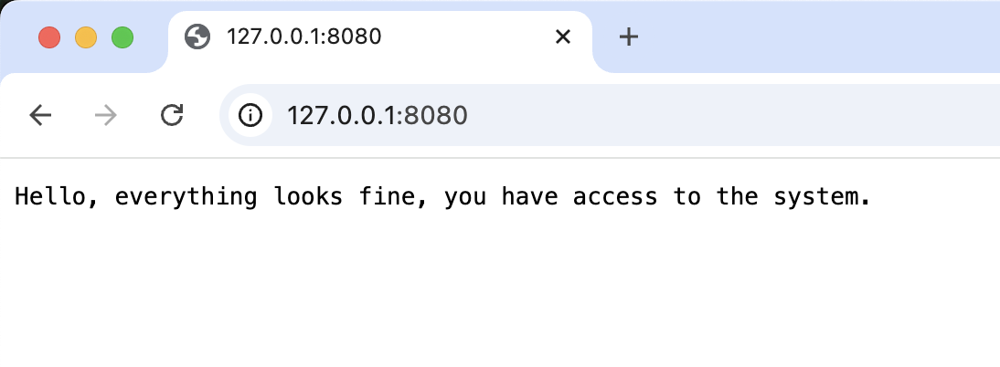
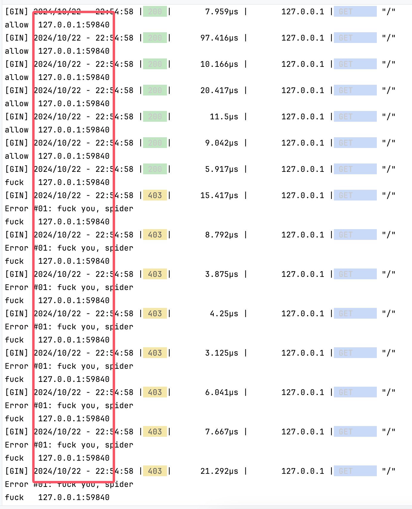
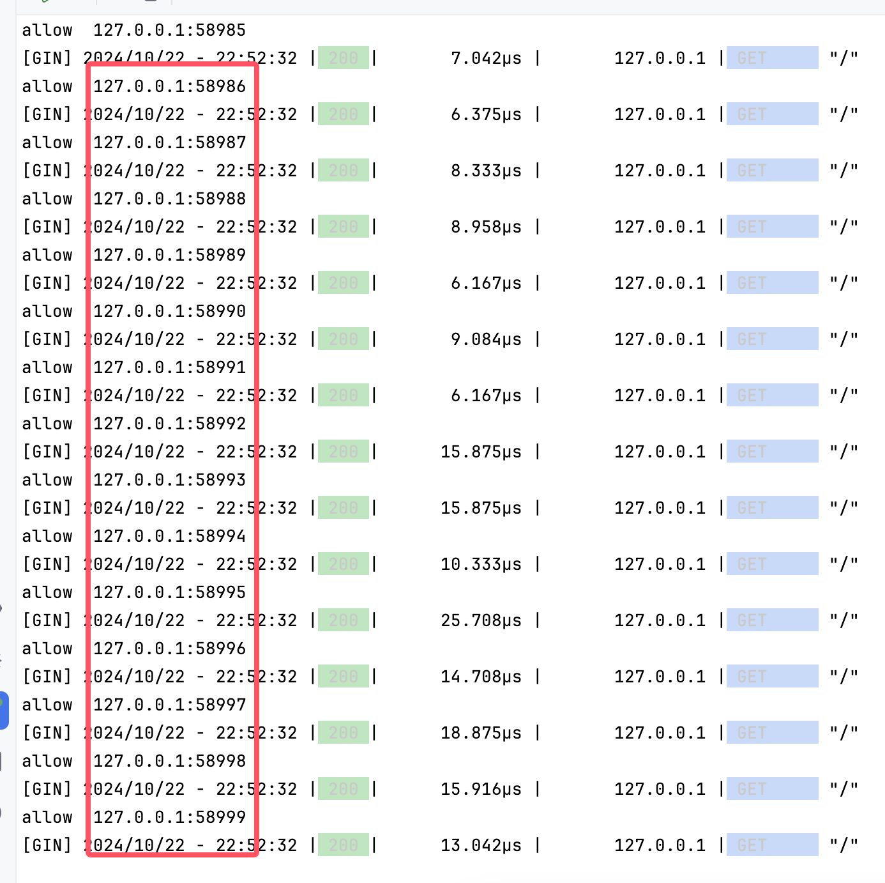

# TCP连接级别限速反爬验证靶场（tcp-rate-limit-goat）

# 一、这是什么？

起因是在论坛里看到一个帖子：

```
https://www.v2ex.com/t/1079960
```


看到这个策略蛮有意思的就做了个靶场体验一下，这是一个根据同一个TCP链接进行访问速度限制的例子，在TCP连接级别对请求速率进行限制，实用性不高实际业务需要谨慎使用，此处仅作为趣味拓展练习。

注意：真实用户使用Chrome浏览器等访问网站的时候默认是keep-alive，使用的是同一个tcp连接，所以请不要无脑复制此策略到您的生产环境，请根据业务实际情况合理设计反爬策略！

# 二、下载 & 启动

## 2.1 从Releases下载

在releases页面选择合适自己系统的可执行文件下载：

https://github.com/JSREI/tcp-rate-limit-goat/releases

## 2.2 从源码编译运行

前置要求：

- 本地安装了golang sdk 1.8+
- 本地8080端口未被占用

克隆仓库代码到本地：

```bash
git@github.com:JSREI/tcp-rate-limit-goat.git
```

进入克隆后的本地的文件夹：

```bash
cd tcp-rate-limit-goat
```

可以在本地直接从源代码运行：

```bash
go run main.go 
```

也可以先编译为平台对应的二进制：

```bash
go build
```

然后再运行二进制：

```bash
./tcp-rate-limit-goat
```

在浏览器访问url确认部署成功：

```bash
http://127.0.0.1:8080/
```

能看到这个界面说明部署成功：



# 三、测试代码

下面是一个测试代码，在Python中的requests复用了Session来发送请求：

```python
# -*- coding: utf-8 -*-
#
# Copyright (C) 2023 by JSREI
# Full license can be found in the LICENSE file.
#
# Author: CC11001100
# URL: https://github.com/JSREI/tcp-rate-limit-goat
#
# Version: 1.0

########################################################################################################################
#
# 复用了tcp连接的情况，使用了同一个Session的会复用同一个tcp连接，因此就可能被识别到
#
########################################################################################################################

import requests
from requests.adapters import HTTPAdapter
from urllib3.util.retry import Retry

# 设置重试策略
retry_strategy = Retry(
    total=3,  # 最多重试3次
    status_forcelist=[429, 500, 502, 503, 504],  # 指定哪些状态码需要重试
)

adapter = HTTPAdapter(max_retries=retry_strategy)
session = requests.Session()

# 为session挂载adapter，指定http和https都使用这个adapter
session.mount("http://", adapter)
session.mount("https://", adapter)

url = 'http://127.0.0.1:8080'  # 你请求的URL

# 发送30次请求
for seqNum in range(1, 31):
    response = session.get(url)
    print(f"{seqNum}: Status Code: {response.status_code}, response = {response.text}")  # 打印状态码

# 关闭Session
session.close()
```

Session复用底层的TCP连接使用的也是同一个，当请求此服务时如果是复用了tcp连接的话则会被服务端识别出来，执行结果：

```
/Users/cc11001100/github/JSREI/tcp-rate-limit-goat/poc/venv/bin/python /Users/cc11001100/github/JSREI/tcp-rate-limit-goat/poc/reuse-tcp-connection.py 
/Users/cc11001100/github/JSREI/tcp-rate-limit-goat/poc/venv/lib/python3.9/site-packages/urllib3/__init__.py:35: NotOpenSSLWarning: urllib3 v2 only supports OpenSSL 1.1.1+, currently the 'ssl' module is compiled with 'LibreSSL 2.8.3'. See: https://github.com/urllib3/urllib3/issues/3020
  warnings.warn(
1: Status Code: 200, response = Hello, everything looks fine, you have access to the system.
2: Status Code: 200, response = Hello, everything looks fine, you have access to the system.
3: Status Code: 200, response = Hello, everything looks fine, you have access to the system.
4: Status Code: 200, response = Hello, everything looks fine, you have access to the system.
5: Status Code: 200, response = Hello, everything looks fine, you have access to the system.
6: Status Code: 200, response = Hello, everything looks fine, you have access to the system.
7: Status Code: 200, response = Hello, everything looks fine, you have access to the system.
8: Status Code: 200, response = Hello, everything looks fine, you have access to the system.
9: Status Code: 200, response = Hello, everything looks fine, you have access to the system.
10: Status Code: 200, response = Hello, everything looks fine, you have access to the system.
11: Status Code: 200, response = Hello, everything looks fine, you have access to the system.
12: Status Code: 200, response = Hello, everything looks fine, you have access to the system.
13: Status Code: 200, response = Hello, everything looks fine, you have access to the system.
14: Status Code: 200, response = Hello, everything looks fine, you have access to the system.
15: Status Code: 200, response = Hello, everything looks fine, you have access to the system.
16: Status Code: 200, response = Hello, everything looks fine, you have access to the system.
17: Status Code: 200, response = Hello, everything looks fine, you have access to the system.
18: Status Code: 200, response = Hello, everything looks fine, you have access to the system.
19: Status Code: 200, response = Hello, everything looks fine, you have access to the system.
20: Status Code: 200, response = Hello, everything looks fine, you have access to the system.
21: Status Code: 403, response = 
22: Status Code: 403, response = 
23: Status Code: 403, response = 
24: Status Code: 403, response = 
25: Status Code: 403, response = 
26: Status Code: 403, response = 
27: Status Code: 403, response = 
28: Status Code: 403, response = 
29: Status Code: 403, response = 
30: Status Code: 403, response = 

Process finished with exit code 0
```

可以看到总共发送了30个请求，其中前20个请求是成功的，再之后的10个请求都403被拒绝访问了，看服务端的日志会发现都是客户端都是同一个`127.0.0.1:57843`的端口发过来的请求：



然后不共享Session发请求再来看一下：

```python
# -*- coding: utf-8 -*-
#
# Copyright (C) 2023 by JSREI
# Full license can be found in the LICENSE file.
#
# Author: CC11001100
# URL: https://github.com/JSREI/tcp-rate-limit-goat
#
# Version: 1.0

########################################################################################################################
#
# 未复用tcp连接的情况，不会被识别到，但是每次请求都需要重新建立tcp连接
#
########################################################################################################################

import requests

url = 'http://127.0.0.1:8080'  # 你请求的URL

# 发送100次请求
for seqNum in range(1, 31):
    response = requests.get(url)
    print(f"{seqNum}: Status Code: {response.status_code}, response = {response.text}")  # 打印状态码

```

执行结果：

```
/Users/cc11001100/github/JSREI/tcp-rate-limit-goat/poc/venv/bin/python /Users/cc11001100/github/JSREI/tcp-rate-limit-goat/poc/no-multiplexing-of-tcp-connections.py 
/Users/cc11001100/github/JSREI/tcp-rate-limit-goat/poc/venv/lib/python3.9/site-packages/urllib3/__init__.py:35: NotOpenSSLWarning: urllib3 v2 only supports OpenSSL 1.1.1+, currently the 'ssl' module is compiled with 'LibreSSL 2.8.3'. See: https://github.com/urllib3/urllib3/issues/3020
  warnings.warn(
1: Status Code: 200, response = Hello, everything looks fine, you have access to the system.
2: Status Code: 200, response = Hello, everything looks fine, you have access to the system.
3: Status Code: 200, response = Hello, everything looks fine, you have access to the system.
4: Status Code: 200, response = Hello, everything looks fine, you have access to the system.
5: Status Code: 200, response = Hello, everything looks fine, you have access to the system.
6: Status Code: 200, response = Hello, everything looks fine, you have access to the system.
7: Status Code: 200, response = Hello, everything looks fine, you have access to the system.
8: Status Code: 200, response = Hello, everything looks fine, you have access to the system.
9: Status Code: 200, response = Hello, everything looks fine, you have access to the system.
10: Status Code: 200, response = Hello, everything looks fine, you have access to the system.
11: Status Code: 200, response = Hello, everything looks fine, you have access to the system.
12: Status Code: 200, response = Hello, everything looks fine, you have access to the system.
13: Status Code: 200, response = Hello, everything looks fine, you have access to the system.
14: Status Code: 200, response = Hello, everything looks fine, you have access to the system.
15: Status Code: 200, response = Hello, everything looks fine, you have access to the system.
16: Status Code: 200, response = Hello, everything looks fine, you have access to the system.
17: Status Code: 200, response = Hello, everything looks fine, you have access to the system.
18: Status Code: 200, response = Hello, everything looks fine, you have access to the system.
19: Status Code: 200, response = Hello, everything looks fine, you have access to the system.
20: Status Code: 200, response = Hello, everything looks fine, you have access to the system.
21: Status Code: 200, response = Hello, everything looks fine, you have access to the system.
22: Status Code: 200, response = Hello, everything looks fine, you have access to the system.
23: Status Code: 200, response = Hello, everything looks fine, you have access to the system.
24: Status Code: 200, response = Hello, everything looks fine, you have access to the system.
25: Status Code: 200, response = Hello, everything looks fine, you have access to the system.
26: Status Code: 200, response = Hello, everything looks fine, you have access to the system.
27: Status Code: 200, response = Hello, everything looks fine, you have access to the system.
28: Status Code: 200, response = Hello, everything looks fine, you have access to the system.
29: Status Code: 200, response = Hello, everything looks fine, you have access to the system.
30: Status Code: 200, response = Hello, everything looks fine, you have access to the system.

Process finished with exit code 0
```

可以看到所有的请求都成功了，并没有被403拒绝的请求，再看下服务端的日志：



会发现客户端的端口是每次都在变的，说明不是同一个tcp连接，因此基于tcp连接进行的策略便不好对其识别关联。

# 四、TODO

- 有更多想法请提issue讨论

# 五、参考链接

- https://www.v2ex.com/t/1079960

# 六、反爬逆向技术交流群

扫码加入逆向技术交流群：


如群二维码过期，可以加我个人微信，发送【逆向群】拉你进群：


[点此](https://t.me/jsreijsrei)或扫码加入TG交流群：


